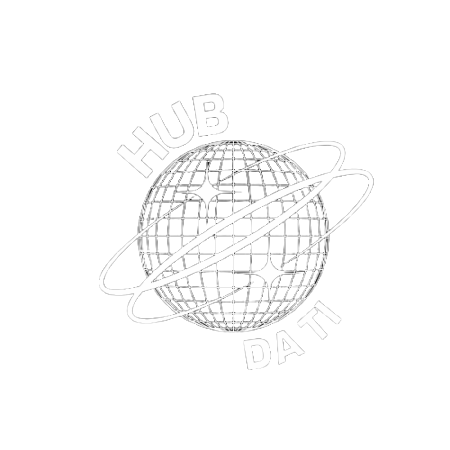

# Hub da TI

<h2>Projeto Intergrador do curso de Introdução a Programação da Proz Tecnologia</h2>

 O Hub da TI é um blog onde você encontra notícias, cursos, História e muito mais sobre a área tech! 

Nele, além se manter-se informado e antenado sobre as novidades em tecnologia, você encontra diversos assuntos para aprender e se inspirar e, de quebra, ainda pode fazer tudo isso ouvindo a nossa playlist de músicas!
 

https://github.com/BarachoSilva/hub-da-ti/assets/78877580/b8028fe4-46b5-4f08-9ada-29948e5e3b6e 

<h3>📱 Também trabalhamos a responsividade das páginas para se adaptarem a vários tamanhos de tela 📱</h3> 

https://github.com/BarachoSilva/hub-da-ti/assets/78877580/269b22d0-390c-41a2-ad00-bdc2dbb0cccb 

 

<h2 align="center"> Linguagens utilizadas: </h2>

<table align="center">
<tr>
  <th> HTML </th>
  <th> CSS </th>
  <th> JS </th>
</tr>
<tr>
  <td>  </td>
  <td>  </td>
  <td>  </td>
</tr>
</table>

 
Conheça nosso blog! Um trabalho desenvolvido com muito carinho ♥

[Link do blog](https://barachosilva.github.io/hub-da-ti/index.html) 

Ouça a nossa playlist e curta conosco nossas músicas preferidas!

[Spotify](https://open.spotify.com/playlist/5oXikMpeH9JXyUp7wifsnM) 

No link abaixo você pode ver nossa apresentação e conhecer um pouco mais sobre nosso projeto.

[Apresentação](https://docs.google.com/presentation/d/1eWK90Y1qzP8j02NS-l1UXReVDHYRfBanuiOj8NlWGOI/edit?usp=drive_link)  

# Desenvolvedores

| [ Thais D'avilla](https://github.com/ThaisDavilla) <https://www.linkedin.com/in/thaisdavilla/> |  [ Alex Baracho](https://github.com/BarachoSilva) <https://www.linkedin.com/in/alex-silvarb/> |  [ Victor Moreira](https://github.com/victoradmoreira) <https://www.linkedin.com/in/victor-moreira-355b07242/> |  [ Joice JeniSilva](https://github.com/JoiceJeni) <https://www.linkedin.com/in/joice-silva-309b56246/> |
| :---: | :---: | :---: | :---: |

<h2 align="center">
    :construction:  Projeto em construção e atualização  :construction:
</h2>

